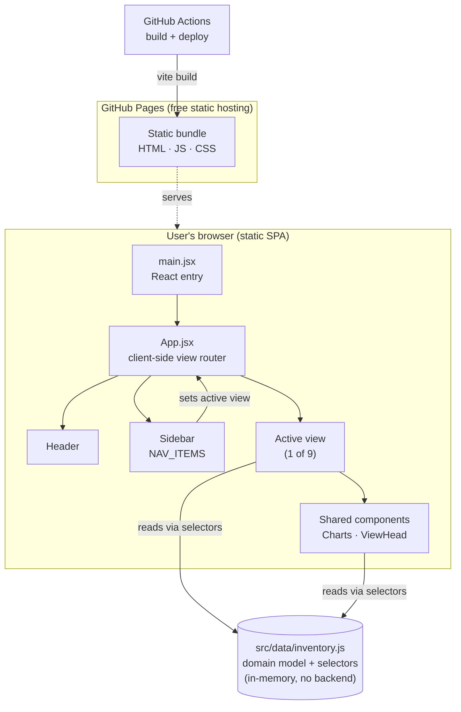

# Retail Inventory Management Dashboard

An interactive "control tower" for multi-warehouse, multi-store retail inventory. It pulls stock positions, replenishment, purchasing, goods receipt, inter-site transfers and supplier performance into a single screen — the kind of decisions normally spread across several ERP modules and a pile of spreadsheets.

**Live demo:** https://avixd.github.io/retail-inventory-app/

> **Demo project.** All data is synthetic and generated for demonstration; it does not represent any real company, supplier or system. The app is a static front end with no backend and no network calls — every action (raising a PO, posting a goods receipt, transferring stock) runs in memory and resets on refresh. Nothing is stored, sent or transmitted. Figures are in Canadian dollars (CAD).

## The business problem

In a growing retailer, the questions that decide margin and availability are simple to ask and hard to answer quickly:

- What is about to run out, and what should I reorder today?
- How much capital is sitting in back-of-house and warehouse reserve rather than on the shelf?
- Where are my purchase orders stuck, and how much do I owe suppliers and when?
- Which suppliers are actually earning their volume, and where is my spend concentrated?

In most operations those answers live in different systems (an ERP for stock, a separate procurement module, a finance ledger, a supplier scorecard someone maintains by hand). Pulling them together is manual, slow, and out of date by the time it is finished. The cost is real: overstocks tie up working capital, stockouts lose sales, and slow supplier decisions leave savings on the table.

## The solution

A single-page dashboard that unifies those questions into nine linked views over one shared data model, so a planner or analyst can move from a headline number to the underlying rows in a couple of clicks.

| Area | View | What it answers |
|---|---|---|
| Overview | Inventory Overview | On-hand trend, inventory value at cost and retail, split by category and location |
| Overview | Reorder / Low-Stock | Which SKUs are at or below reorder point, and the suggested PO value to cover them |
| Inventory | Off-Shelf · Warehouse | Reserve stock, warehouse floor map with bin fill levels, and capital tied up off the shelf |
| Inventory | Stock Movements | Recent inbound, outbound and adjustment activity |
| Procurement | Orders · Procure-to-Pay | PO pipeline by lifecycle stage, cycle time, outstanding payables, and a raise-a-PO flow |
| Procurement | Goods Receipt | Post goods receipt notes (GRNs) against open POs |
| Procurement | Transfer Orders | Inter-site stock transfers and their status |
| Master Data | Suppliers & Products | Vendor and SKU master data with cost, price and margin |
| Master Data | Supplier Performance | Weighted scorecards, cohort segmentation, spend Pareto, and payment-terms / working-capital analysis |

## Solution approach

The design follows one principle: **model the domain once, render it many ways.**

1. **A single in-memory domain model** (`src/data/inventory.js`) holds the entities a retailer actually works with — warehouses and stores, suppliers, products, stock, storage bins, purchase orders, invoices, transfers, movements and goods receipts.
2. **Business logic lives as pure selector functions** over that model — reorder detection, supplier scoring, spend Pareto, PO lifecycle roll-ups, cycle time, warehouse bin capacity and fill tiers. The views never recompute this logic; they call a selector and render the result.
3. **Views are thin.** Each of the nine screens is a presentation layer that composes shared chart and table components. This keeps every number on screen traceable to exactly one function, which is what makes the app both testable and honest.

The full reasoning, including trade-offs and what a production version would change, is in [`docs/`](docs/).

## High-level architecture



No server, no database, no authentication, no external API. The entire application is static files, which is what makes public hosting free, read-only for visitors, and impossible to expose credentials through — there are none in the bundle.

## Tech stack

| Layer | Choice | Why |
|---|---|---|
| UI framework | React 19 | Component model suits nine views sharing one data source |
| Build tool | Vite 8 | Fast dev server and small production bundles |
| Charts | Recharts 3 | Declarative, composable React charts |
| Icons | lucide-react | Consistent, lightweight icon set |
| Type font | Inter (self-hosted) | No third-party font CDN call |
| Hosting | GitHub Pages via GitHub Actions | Free, static, auto-deployed on push |

## Documentation

| Document | Contents |
|---|---|
| [docs/architecture.md](docs/architecture.md) | System model, data model and selectors, component hierarchy, data-flow and deployment diagrams |
| [docs/technical-walkthrough.md](docs/technical-walkthrough.md) | The solution approach at each stage, view by view, with the key logic behind each screen |
| [docs/decisions.md](docs/decisions.md) | Tools used and why, assumptions, pros, cons and limitations of the approach |

## Run locally

```bash
npm install
npm run dev      # http://localhost:5173
```

Production build:

```bash
npm run build    # static output in dist/
npm run preview  # serve the built bundle
```

## Licence

All rights reserved. This repository is published for **viewing and evaluation only** — see [LICENSE](LICENSE). Please do not copy, modify, redistribute or reuse the code or assets without permission.
