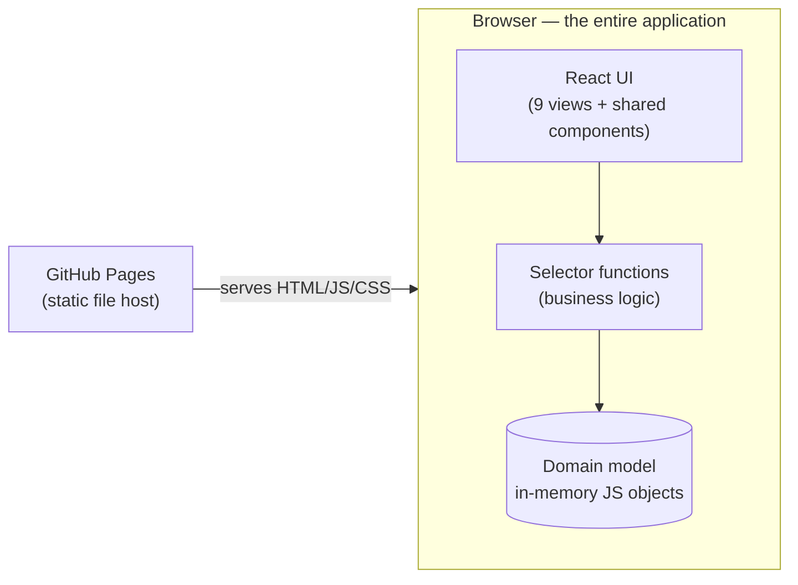
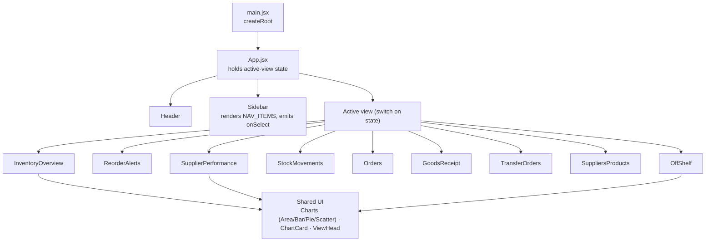
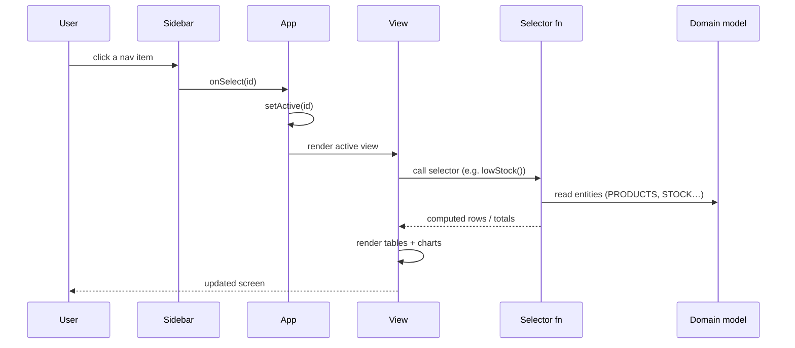
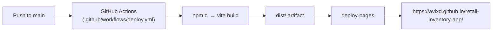

# Architecture

This document describes how the application is put together: the system model, the data model and its selector functions, the component hierarchy, and how data flows from a raw record to a number on screen.

## 1. System model

The application is a **static single-page application (SPA)**. There is no backend, no database and no API. Everything the app knows lives in one JavaScript module that ships inside the bundle; everything the app shows is derived from that module at render time.

This choice is deliberate. A static app is free to host, has no attack surface around a server or database, cannot leak credentials (there are none), and is trivial for a reviewer to open. The cost is that data does not persist and cannot be shared between users — acceptable for a demonstration, and revisited in [decisions.md](decisions.md).

## 2. Data model

All domain data is defined in `src/data/inventory.js`. It plays the role a database would in a production system: a set of related entities that the rest of the app reads from. Records are hand-authored to be internally consistent (a PO line references a real SKU; a bin references a real warehouse) so the derived numbers hold together.

### Entities

| Export | Represents | Key fields |
|---|---|---|
| `WAREHOUSES` | Distribution centres and retail stores | `id`, `name`, `type`, `city`, `region` |
| `SUPPLIERS` | Vendors | `id`, `name`, `terms`, `onTimeRate`, `defectRate`, `fillRate`, `leadDays`, `actualLeadDays`, `spendYtd`, `since` |
| `PRODUCTS` | SKUs (master data) | `sku`, `name`, `category`, `supplierId`, `unitCost`, `unitPrice`, `reorderPoint` |
| `STOCK` | On-hand per SKU | `sku`, `onShelf`, `offShelf` |
| `SHELF` | On-shelf units distributed across stores | `{ sku: { storeId: qty } }` |
| `BINS` | Off-shelf units in warehouse bin locations | `warehouse`, `bin`, `sku`, `qty` |
| `PURCHASE_ORDERS` | POs with line items and lifecycle status | `po`, `supplierId`, `status`, `lines[]`, dates |
| `INVOICES` | Supplier invoices | `supplierId`, `amount`, `status` |
| `TRANSFER_ORDERS` | Inter-site stock transfers | source, destination, SKU, qty, status |
| `MOVEMENTS` | Stock ledger (in/out/adjust) | type, SKU, qty, location |
| `GRNS` | Goods receipt notes | `grn`, `po`, `warehouse`, units, status |

The two-sided stock model is worth calling out: **on-shelf** stock is held at stores (`SHELF`) and **off-shelf** reserve stock is held at distribution centres (`BINS`). Views can scope either side independently by location, which is why on-shelf and off-shelf are stored separately rather than as one number.

### Selector functions (business logic)

The views do not contain business logic. All calculation is in pure functions over the entities, so each figure has exactly one source of truth. The main selectors:

| Function | Returns |
|---|---|
| `onHand(sku)` | Total units for a SKU (on-shelf + off-shelf) |
| `lowStock()` | SKUs at or below reorder point, with suggested order quantity and value |
| `totals()` | Portfolio roll-ups: unit counts and inventory value at cost and retail |
| `scopedRows(skus, loc)` | Per-SKU on/off-shelf units, filtered by product set and location |
| `onShelfByStore` / `offShelfByWarehouse` | Units by location, respecting the current scope |
| `warehouseFloor(whId)` | Full bin layout for a site: occupied + empty bins, grouped by aisle, with fill % and a conditional-format tier |
| `siteBinCapacity(whId)` | Per-bin capacity, calibrated per site so empty / half / full states are visible |
| `poStatusSummary()` | PO value and count per lifecycle bucket (Draft → Closed) |
| `avgPoCycleTime()` | Mean create-to-close days across completed POs |
| `outstandingByTerms()` | Unpaid supplier payables grouped by payment terms |
| `supplierScore(s)` | Weighted 0–100 score from six criteria, plus the component parts |
| `supplierCohort(score)` | Segments a score into Strategic / Preferred / Approved / Watchlist |
| `supplierMetrics()` | Every supplier enriched with score, cohort and derived fields, sorted by spend |
| `spendContribution()` | Pareto ranking of suppliers by spend with cumulative %, plus top-10 share |
| `cohortSummary()` | Cohort roll-up: count, spend and inventory value per tier |

The supplier score is the most involved piece of logic. Six weighted criteria (on-time delivery 25%, quality 20%, fill rate 15%, lead-time reliability 15%, payment terms 15%, relationship 10%) each map a raw supplier field onto a 0–100 sub-score, and the weighted sum produces the headline number that drives cohort assignment. The weights and thresholds are defined in one place (`SUPPLIER_WEIGHTS`, `COHORT_META`) so the model is transparent and tunable.

## 3. Component hierarchy

`App.jsx` is a deliberately small client-side router: it keeps a single `active` string in React state, looks up the matching view component in a `VIEWS` map, and renders it. The `Sidebar` is the only thing that changes that state. There is no routing library and no URL sync — navigation is one piece of state and a lookup, which is all nine self-contained views need.

## 4. Data flow

A number reaches the screen the same way every time: a view calls a selector, the selector reads entities, the view hands the result to a component.

In-app actions (raising a PO, posting a GRN, transferring stock) follow the same pattern but write to **local React state** in the view, not to the shared model. They are visual confirmations, scoped to the session, and reset on refresh — which is why the app can be safely public and read-only.

## 5. Build and deployment

Vite builds the app to static files in `dist/`. `vite.config.js` sets `base: '/retail-inventory-app/'` so asset paths resolve under the GitHub Pages project subpath. On every push to `main`, the Actions workflow builds and publishes the bundle to Pages. There is nothing to provision and nothing to pay for.
